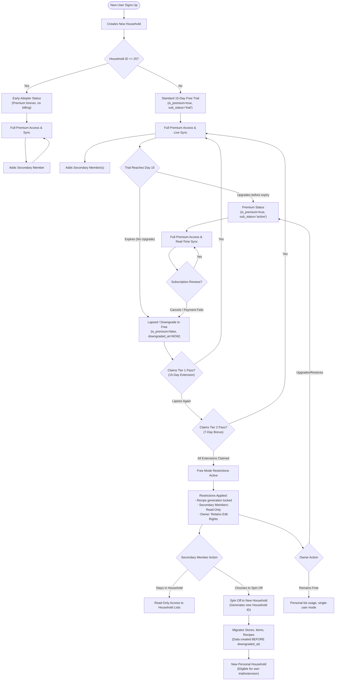

# User Lifecycle, Household Status & Tier Transitions (`user_lifecycle.md`)

This document illustrates the complete lifecycle of a user and household in ListMate, covering Early Adopters, Free Trials, Extension Ladders, Premium Upgrades, Downgrades, and Secondary Member Spin-offs.

---

## 1. Complete Lifecycle Flowchart

---

## 2. Explanation of Lifecycle Scenarios

### 1. Early Adopter Tier (Households 1 - 25)
* Households registered with ID $\le 25$ automatically receive `is_premium = true` and `subscription_status = 'premium'`.
* They never see paywalls or trial countdowns.
* They receive the **Lifetime Premium Monthly Digest** on the 1st of every month summarizing their household's activity and top stores.

### 2. Standard Trial & Extension Ladder (Households 26+)
* Upon signup, households receive a **15-day free trial** with full premium features (live sync, unlimited custom stores, aisle sorting, recipe planner).
* **Tier 1 Extension (15 Days)**: When the trial lapses, households can activate a 15-day extension pass (`trial_ext_15d_claimed_at`), bringing total trial evaluation time to 30 days.
* **Tier 2 Extension (7 Days)**: Offered post-trial via the Day 37 cron (`trial_ext_day7`) or winback passes (`trial_winback_ext_7d`), extending access by an additional 7 days (total 37 days lifetime).
* **Legacy Cohort**: Households that originally received a 30-day initial trial are capped at 37 days by advancing directly to the 7-day bonus tier.

### 3. Active Premium Subscription
* When an owner purchases either the **$1.99/month** or **$9.99/year** plan via RevenueCat, their household is marked `subscription_status = 'active'`.
* **Household-Wide Coverage**: All secondary members join and edit completely free without individual subscriptions.

### 4. Downgrade & Free Mode Soft Landing
* When all trials and extensions lapse without an upgrade, `is_premium` switches to `false` and `downgraded_at` is stamped.
* **Owner**: Retains full ability to manage and check off personal lists.
* **Secondary Members**: Transition to `is_read_only = true` (enforcing `FREE_TIER_MEMBER_LIMIT = 1`).

### 5. Secondary Member Spin-Off
* Secondary members who wish to regain edit privileges can invoke `/api/household/spin-off`.
* The backend clones stores, items, and recipes created **prior to** `downgraded_at` into a fresh household, allowing them to continue shopping independently on their own trial.
