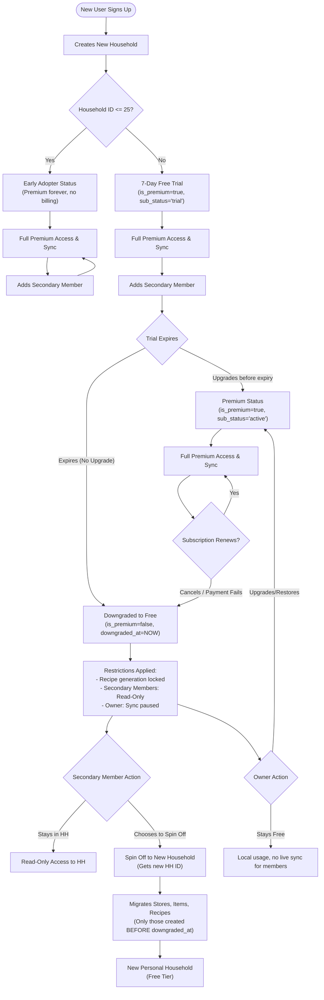

# User Lifecycle & Household Status

This document illustrates the lifecycle of a user's household, including Early Adopters, Free Trials, Premium Upgrades, Downgrades, and Secondary Member Spin-offs.

## Lifecycle Flowchart

## Explanation of Scenarios

1. **Early Adopter**: The first 25 households get `is_early_adopter` flag via ID checks. They always get Premium features, and secondary members always have sync.
2. **Standard Premium & Renewal**: After household 25, users get a trial. If they upgrade, they maintain `is_premium = true`. Secondary members get live sync. 
3. **Downgrade & Spin-Off**: If a standard user's trial or premium expires, `is_premium` becomes `false` and a timestamp `downgraded_at` is set. Secondary members become **Read-Only**. To regain edit access, a secondary member can "Spin Off" to a new personal household. The app migrates items they had access to **before** the `downgraded_at` timestamp so that they don't get data created by the owner while the secondary member was read-only.
